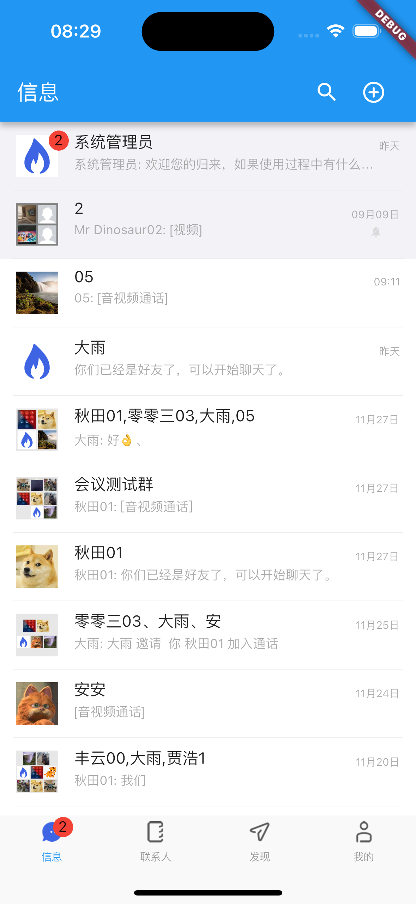
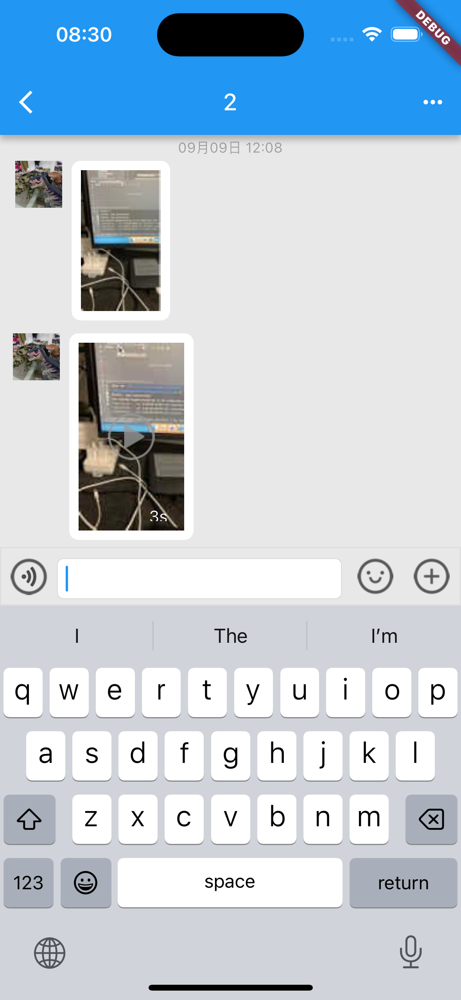
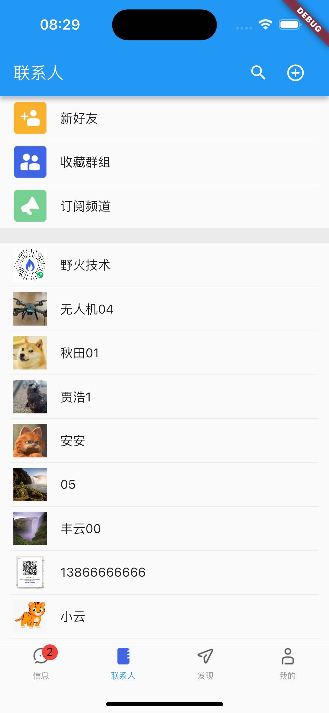
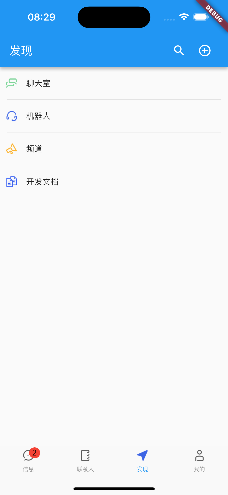
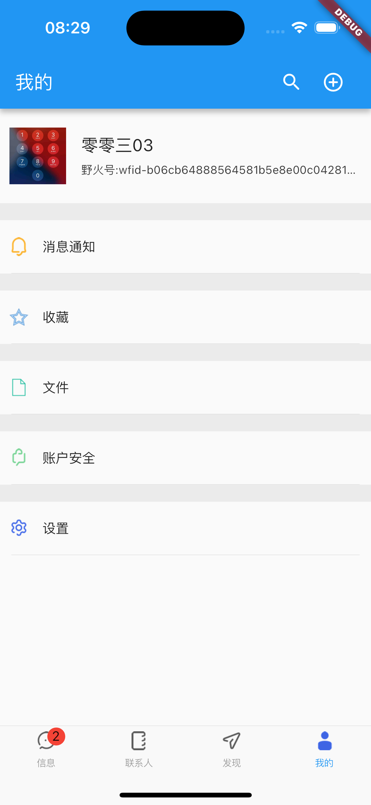
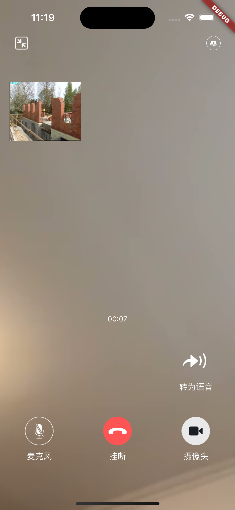
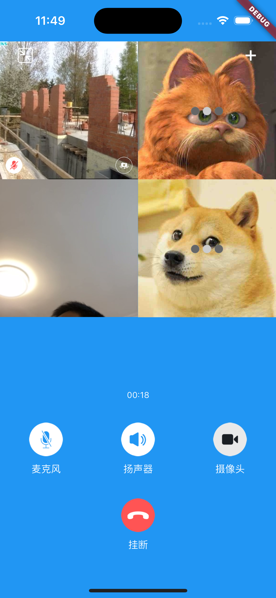

## 最重声明!!!

Android 和 iOS 可以免费使用，其中iOS可以直接配置 IM_SERVER_HOST来设定服务地址。Android需要联系我们免费获取SDK。

**因反诈合规要求，本项目协议栈默认仅支持连接野火官方服务，不能连接到自行部署的服务。如需获取不受限版本，请联系官方微信（wfchat 或 wildfirechat）免费申请。**

> 联系官方获取到不受限版本后，请替换`./imclient/android/android_client_aars/mars-core-release.aar`文件，并重新编译。

其他平台，包括Windows/Mac/Linux/Harmony平台是付费的，需要联系我们申请试用或者购买，请联系官方微信（wfchat 或 wildfirechat）免费申请。

---------


## 野火IM解决方案

野火IM是专业级即时通讯和实时音视频整体解决方案，由北京野火无限网络科技有限公司维护和支持。

主要特性有：私有部署安全可靠，性能强大，功能齐全，全平台支持，开源率高，部署运维简单，二次开发友好，方便与第三方系统对接或者嵌入现有系统中。详细情况请参考[在线文档](https://docs.wildfirechat.cn)。

主要包括一下项目：

| [GitHub仓库地址(主站)](https://github.com/wildfirechat)            | [码云仓库地址(镜像)](https://gitee.com/wfchat)                | 说明                                                             | 备注                      |
|--------------------------------------------------------------|-------------------------------------------------------|----------------------------------------------------------------|-------------------------|
| [android-chat](https://github.com/wildfirechat/android-chat) | [android-chat](https://gitee.com/wfchat/android-chat) | 野火IM Android SDK源码和App源码                                       | 可以很方便地进行二次开发，或集成到现有应用当中 |
| [ios-chat](https://github.com/wildfirechat/ios-chat)         | [ios-chat](https://gitee.com/wfchat/ios-chat)         | 野火IM iOS SDK源码和App源码                                           | 可以很方便地进行二次开发，或集成到现有应用当中 |
| [pc-chat](https://github.com/wildfirechat/pc-chat)           | [pc-chat](https://gitee.com/wfchat/pc-chat)           | 基于[Electron](https://electronjs.org/)开发的PC平台应用                 |                         |
| [web-chat](https://github.com/wildfirechat/web-chat)         | [web-chat](https://gitee.com/wfchat/web-chat)         | Web平台的Demo, [体验地址](http://web.wildfirechat.cn)                 |                         |
| [wx-chat](https://github.com/wildfirechat/wx-chat)           | [wx-chat](https://gitee.com/wfchat/wx-chat)           | 微信小程序平台的Demo                                                   |                         |
| [server](https://github.com/wildfirechat/server)             | [server](https://gitee.com/wfchat/server)             | IM server                                                      |                         |
| [app server](https://github.com/wildfirechat/app_server)     | [app server](https://gitee.com/wfchat/app_server)     | 应用服务端                                                          |                         |
| [robot_server](https://github.com/wildfirechat/robot_server) | [robot_server](https://gitee.com/wfchat/robot_server) | 机器人服务端                                                         |                         |
| [push_server](https://github.com/wildfirechat/push_server)   | [push_server](https://gitee.com/wfchat/push_server)   | 推送服务器                                                          |                         |
| [docs](https://github.com/wildfirechat/docs)                 | [docs](https://gitee.com/wfchat/docs)                 | 野火IM相关文档，包含设计、概念、开发、使用说明，[在线查看](https://docs.wildfirechat.cn/) |                         |  |

## 技术交流

1. 如果大家发现bug，请在GitHub或码云提issue；如果有需求也请给我们提issue。
2. 其他问题，请到[野火IM论坛](http://bbs.wildfirechat.cn/)进行交流学习
3. 关注我们的公众号。我们有新版本发布或者有重大更新会通过公众号通知大家，另外我们也会不定期的发布一些关于野火IM的技术介绍。


我们有核心研发工程师轮流值班处理issue和论坛，会及时处理的，疑难Bug的修改和新需求的开发我们也会尽快解决。

# flutter-chat

野火Flutter版 demo， 支持 Android、iOS、原生鸿蒙和桌面端（Windows、macOS、Linux），包含即时通讯插件和实时音视频插件。不支持龙芯和申威CPU（因为flutter不支持），其他国产操作系统和CPU都支持。

## 桌面端截图

本项目桌面端（Windows/macOS/Linux）使用 [flameshot](https://flameshot.org/) 作为独立截图工具，通过 `Process.run` 调起。详细的构建、打包、权限与许可证说明请参考 [SCREENSHOT.md](./SCREENSHOT.md)。

> **macOS 沙盒注意**：macOS 的 App Sandbox 会限制 flameshot 访问屏幕录制/窗口服务，导致截图功能无法正常初始化。因此 macOS 版本需要**关闭 App Sandbox**（已移除 `com.apple.security.app-sandbox`）才能使用截图。这也意味着当前配置**无法直接上架 Mac App Store**；如必须走 App Store，需改用原生 `ScreenCaptureKit` 方案。

## 关于 Flutter 、Android Studio、Gradle 版本的重要说明

1. 为了能够兼容原生鸿蒙，Flutter 版本会跟随原生鸿蒙已适配的Flutter 版本进行升级，目前鸿蒙原生已适配的Flutter版本是`3.27.4`
2. Android Studio 会跟随官方更新，一直使用最新版本
3. 由于 gradle 版本和 flutter 版本有依赖关系，会使用对应的 gradle 版本，目前是 `8.7`
4. 如果不需要支持鸿蒙，可使用`flutter-standard`分支

## 关于鸿蒙的重要说明
1. 鸿蒙版所依赖的 野火IM 鸿蒙SDK 是需要付费的
2配置镜像
    > 由于目标是能兼容原生鸿蒙，有的包只能从镜像下载，不配置镜像的话，可能下载不到
    ```
   # Linux、macOS
   export PUB_HOSTED_URL=https://pub.flutter-io.cn
   export FLUTTER_STORAGE_BASE_URL=https://storage.flutter-io.cn
   
   # windows 
   setx PUB_HOSTED_URL "https://pub.flutter-io.cn"
   setx FLUTTER_STORAGE_BASE_URL "https://storage.flutter-io.cn"
   ```


## 运行
> 由于本项目，同时支持 Android、iOS 和鸿蒙，故只能使用已适配鸿蒙的 Flutter 版本
> 
> 构建 Windows、macOS、Linux 桌面端时，请切换到对应平台的官方 Flutter SDK。使用`flutter-standard`分支，不需要配置鸿蒙适配版 Flutter
> 
> 请参考 [这儿](https://gitcode.com/openharmony-tpc/flutter_flutter) 安装和配置 Flutter，请使用 `oh-3.27.0-release` 分支
>
> 配置成功后，`flutter --version`的输出如下：
>
>
    Flutter 3.27.4 • channel [user-branch] • unknown source
    Framework • revision d8a9f9a52e (11 个月前) • 2025-01-31 16:07:18 -0500
    Engine • revision 82bd5b7209
    Tools • Dart 3.6.2 • DevTools 2.40.3

### 终端运行
进入到项目工程目录下，依次执行下述命令：

1. ``` cd chat && flutter packages get && cd .. ```
2. ``` cd chat/ios/ && pod install && cd ..``` (仅iOS平台需要)
3. ``` cd chat && flutter run --debug -d ${设备 id}```

### 桌面端运行（Windows / macOS / Linux）
1. 确保使用对应平台的官方 Flutter SDK。
2. 进入 `chat` 目录执行 `flutter packages get`。
3. 运行对应命令：
   - macOS：`flutter run -d macos` 或 `flutter build macos`
   - Windows：`flutter run -d windows` 或 `flutter build windows`
     > 需安装 [Visual Studio](https://aka.ms/vs/16/release/vs_community.exe)，完整环境配置说明，请参考 [Set up Windows development](https://docs.flutter.dev/platform-integration/windows/setup)
   - Linux：`flutter run -d linux` 或 `flutter build linux`
     > Linux 环境配置说明，请参考 [Setup Linux development](https://docs.flutter.dev/platform-integration/linux/setup)
4. 桌面端目前仅支持基础 IM 功能，音视频通话、拍照等功能在桌面端会被禁用并提示“当前平台不支持”。

### Android Studio运行
1. 配置 `Flutter SDK Path` 和 `Dart SDK Path` 为鸿蒙适配版的对应路径
2. 运行

## 集成到flutter应用

1. 在项目的```pubspec.yaml```文件依赖配置中，添加如下内容。其中 ```${path_to_imclient}``` 和 ```${path_to_imclient}``` 为 本项目的```imclient```和```rtckit```目录。
    ```
    dependencies:
      flutter:
        sdk: flutter

      imclient:
        path: ${path_to_imclient}
      rtckit:
        path: ${path_to_rtckit}
    ```

2. 在项目```android/app/build.gradle```文件中配置混淆规则，并添加依赖
   ```groovy
      buildTypes {
        release {
            // Signing with the debug keys for now, so `flutter run --release` works.
            signingConfig signingConfigs.debug
            shrinkResources true
            // 是否开启混淆，如果开启了混淆，需要在proguard-rules.pro中添加规则，可参考build.gradle同目录中的混淆棍子，避免混淆掉野火IM相关类。
            // 如果开启混淆，但混淆规则配置错误，应用可能无法启动，或不能正常连接到IM服务。
            minifyEnabled true
            proguardFiles getDefaultProguardFile('proguard-android.txt'), 'proguard-rules.pro'
        }
        debug{
            signingConfig signingConfigs.debug
            shrinkResources true
            // 是否开启混淆，如果开发调试阶段，不想开启混淆，需要显示配置为false。
            minifyEnabled false
        }
    }


      dependencies {

        // 将path_to_android_xxx_aars 替换成实际路径，可以使用相对路径，但一定要保证路径是正确的；路径不对的话，会报 ClassNotFoundException
        // moment 对应的是朋友圈SDK，ptt对应的是对接SDK。仅当购买或者试用这两个功能的用户打开这两个包的引入。

        // wfc dep start
        implementation fileTree(dir: "${path_to_android_client_aars}", include: ["*.aar"])
        implementation fileTree(dir: "${path_to_android_avclient_aars}", include: ["*.aar"])
        //implementation fileTree(dir: "${path_to_android_moment_aars}", include: ["*.aar"])
        //implementation fileTree(dir: "${path_android_ptt_aars}", include: ["*.aar"])

        // wfc dep end
    }
    ```

3. 项目目录下执行 ``` flutter packages get``` 命令。
4. 如果有iOS平台，执行 ``` cd chat/ios/ && pod install ``` 命令。
5. 分别运行 iOS、Android、鸿蒙或桌面端（Windows / macOS / Linux）平台。桌面端需要使用对应平台的官方 Flutter SDK 编译。
6. Android 平台，集成音视频的时候，需要在`AndroidManifest.xml`入口`activity`的配置里面添加如下`intent-filter`
   ```xml
    <!-- 音视频通话，需要加入下面的 intent-filter-->
    <intent-filter>
        <action android:name="${applicationId}.main" />
        <category android:name="android.intent.category.DEFAULT" />
    </intent-filter>

    ```

## 升级插件注意事项

1. 升级插件时，一定要记得同步升级`android_client_aars`和`android_avclient_aars`等`aars`目录

## 推送

### 1 野火推送基础知识

实现推送需要客户端和服务端研发配合实现，首先需要掌握野火推送的流程才可以，关于野火推送的知识，在[野火推送服务](https://gitee.com/wfchat/push_server)的项目说明上有详细描述，请客户端研发和服务端研发详细阅读。

### 2 推送平台的选取

目前有多种推送方案可选，可以选取手机厂商的推送，也可以选取第三方推送。需要根据您的需求来选取适合您的方案。

### 3 客户端的集成

客户端集成选取的推送平台的flutter插件，每个推送插件注册成功后，都会返回一个注册ID（或者是其他名称，能够唯一代表当前推送设备的ID），然后调用```imclient```的下面接口

```
Imclient.setDeviceToken(pushType, deviceToken);
```

### 4 服务端推送开发

下载[野火推送服务](https://gitee.com/wfchat/push_server)，在此基础上进行二次开发。推送服务会收到IM服务的推送请求，推送请求中有这个pushType和deviceToken及要推送的内容，推送服务根据这些信息找到对应厂商进行推送。

### 5 使用个推

实际上可以选用任意一个或者多个推送服务商，这里给出一个使用个推的介绍。
[对接个推](https://gitee.com/wfchat/flutter-chat/issues/I6P16V?from=project-issue)


## iOS 平台 CallKit / Share Extension

本项目 iOS 端已实现 CallKit 来电与系统级 Share Extension 分享，相关文档如下：

- [CallKit 功能说明与移植指南](./CALLKIT_GUIDE.md)
- [Share Extension 功能说明与移植指南](./SHARE_EXTENSION_GUIDE.md)

> 注意：CallKit 需要真机、VoIP Push 证书及服务器端配合才能完整验证；Share Extension 需要主应用与扩展配置同一个 App Group。

## 截图
会话列表



消息界面



联系人列表



发现界面



设置界面



单人视频通话



多人视频通话



## 常见问题

1. `Execution failed for task ':video_player_android:compileDebugJavaWithJavac'.`
    1. 查看 `chat/.flutter-plugins` 找到 `video_player_android` 的位置，macos 时，位置如下: `video_player_android=/Users/your-user-name/.pub-cache/hosted/pub.flutter-io.cn/video_player_android-2.7.1/`
    2. 参考[Remove -Werror from Android build](https://github.com/flutter/packages/pull/7776/files) 修改`android/build.gradle`
2. 鸿蒙上提示包找不到，请从 [flutter_packages](https://gitcode.com/openharmony-tpc/flutter_packages) 查询已适配鸿蒙平台的版本，并固定为该版本


## 一些知识要点

1. 获取token的过程一定是先从客户端获取clientId，然后应用服务使用clientId和userId参数获取token，返回给当前客户端使用。即token是和客户端绑定的，该token仅能在当前客户端使用。
2. 获取用户/群组/频道信息时，都是直接返回本地数据，如果本地没有会返回null且去服务器更新，更新成功后会有eventbus通知。编写UI代码时需要考虑到获取信息为空的可能，并做好监听，以便信息更新能更新UI。
3. 展示消息是分批获取的，先获取最新的一部分，然后列表滚动式再加载下一批，以此类推。
4. 免费版本音视频需要用到turn服务，上线前请部署自己的turn服务，野火提供开发的带宽比较小无法支持商用。
5. IM服务init时可以传入各种事件的回调，另外基本上每个事件都会同时触发EventBus事件通知，当需要某个通知时也可以用EventBus事件，所有事件定义在```imclient.dart```文件中，比如```ConnectionStatusChangedEvent```是连接状态变化事件。其他事件可以在这附近找到。
